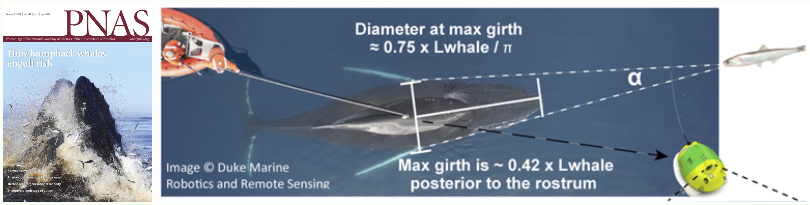

<!-- README.md is generated from README.Rmd. Please edit that file -->

# `attackR`

An `R` package for modelling what an attacking predator looks like to a
prey.

### Summary

This package can be used to model how much of a prey’s visual field is
taken up by an attacking predator, given its size, speed, and shape. It
was used in the following publication in PNAS to determine how much of a
prey’s visual field is occupied by an attacking humpback whale.

It can be used for virtually any predator-prey combination, but there is
also specific functionality to determine how apparent size is affected
by the timing of a whale’s mouth opening during a lunge, though this can
be ignored for other predators.

<br>

> **David E. Cade, Nicholas Carey, Paolo Domenici, Jean Potvin, and
> Jeremy A. Goldbogen. 2020.** Predator-informed looming stimulus
> experiments reveal how large filter feeding whales capture highly
> maneuverable forage fish. *Proceedings of the National Academy of
> Sciences*, 117 (1) 472-478. <https://doi.org/10.1073/pnas.1911099116>



<br> <br>

While the code was applied specifically to humpback whales for this
study, given some simple morphological parameters it can be used to
model how *any* attacking predator appears to a prey. It can also be
applied to other filter-feeding whales which engulf large volumes of
water, such as blue whales, given some inputs regarding mouth morphology
and lunge timings. The package takes full account of the predator’s
three-dimensional shape when determining its perceived size in the
prey’s visual field. This is because at close distances, the maximum
width of the predator will not necessarily make up the widest apparent
visual angle, and more anterior parts of the body will appear to the
prey to be wider, and have a larger apparent size.

From the prey’s perspective the package calculates the visual angle of
the attacker (**α**, in radians), and the rate of change of this angle
(**dα/dt**, in radians/s), as well as distance and time to capture.

### Vignettes

There are two vignettes (see *Articles* above) describing the
functionality of the package and how it was used in the above study:

> [**Overview of
> attackR**](https://nicholascarey.github.io/attackR/articles/main.html)

> [**attackR and whale
> attacks**](https://nicholascarey.github.io/attackR/articles/whales.html)

See also the
[**Reference**](https://nicholascarey.github.io/attackR/reference/index.html)
page to view the detailed Help file for each function.

### Installation

`attackR` is not yet published on CRAN, but can be installed using the
`devtools` package:

``` r
install.packages("devtools")
devtools::install_github("nicholascarey/attackR")
```

### Feedback

If you encounter any bugs or issues, or have feedback, send an
[email](mailto:nicholascarey@gmail.com), or [open an
issue](https://github.com/nicholascarey/attackR/issues).
