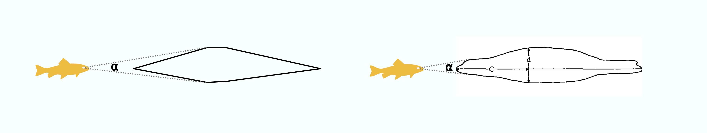

```{r, include = FALSE}
knitr::opts_chunk$set(
  collapse = TRUE,
  comment = "#>"
)
```

```{r setup, echo = FALSE}
library(attackR)
```

The `attackR` package for `R` models how much of a prey's visual field is occupied by a predator as it attacks, given information on the predator shape, size and speed. 

Its intended use is in biological studies of prey escape behaviours, where they are known or hypothesised to respond to particular thresholds of angular size of the predator (e.g. Temizer et al. 2015), or rate of change of this angular size (e.g. Paglianti & Domenici 2006) (note, other models incorporate other variables to determine escape response likelihoods, such as presence of other prey; see Hatsopoulos 1995, Preuss 2006, Hein et al. 2019). 

The code was developed for a study published in PNAS [(Cade et al. 2020)](https://doi.org/10.1073/pnas.1911099116) on humpback whale foraging on anchovies. In the case of whales it has special functionality for determining how the timing of the whale's mouth opening during a lunge feeding event affects how much of the prey's visual field is occupied. However, it can be used with virtually any predator-prey combination. 

```{r, echo=FALSE, fig.cap="Cade et al. 2020", out.width = '40%', fig.align='center'}
knitr::include_graphics("pnascover.jpg")
```

While the following explanation is fairly straightforward and may seem overly precise, the extreme and unique characteristics of the biomechanics of whale lunge feeding necessitated this level of detail. See [HERE] for an explanation of this approach applied to whales.

# Background

When a predator approaches a prey, it occupies space in the prey's visual field. That is, its profile subtends an angle (**⍺**) on the prey's retina, usually determined by its maximum width (Dill 1974):

<br>
```{r, echo=FALSE, out.width = '100%', fig.align='center'}

```
<br>

If the predator comes closer, the angle increases. The rate of change in **⍺**, that is **d⍺/dt**, is simply the change in **⍺** divided by the time this took. 

<br>
```{r, echo=FALSE, out.width = '100%', fig.align='center'}
knitr::include_graphics("schem2.png")
```
<br>

Note as the predator gets closer, depending on its shape the widest *apparent* part of it from the prey's perspective may shift forward along the body. Given a predator shape profile, `attackR` takes account of this shift when calculating **⍺** and **d⍺/dt**. 

As the predator gets closer, it takes up a relatively greater proportion of the visual field, so at constant speeds both **⍺** and **d⍺/dt** show an exponential relationship with distance/time:

<br>
```{r, echo=FALSE, out.width = '100%', fig.align='center'}
knitr::include_graphics("Rplot.png")
```
<br>

The **d⍺/dt** allows the prey to judge how fast the predator is approaching, decide if it is a threat and thus whether to initiate an escape response. Studies have shown many prey species react to consistent values of **d⍺/dt** which, when applied to their common predators, represent evolutionarily determined predator speed:distance combinations which minimise redundant or unnecessary escape attempts but maximise the chances of escape when the predator is a real threat.

From the prey perspective, the attacker can be approximated by a circular shape projected on a screen that reproduces the same **⍺** and **d⍺/dt** at a particular viewing distance. These 'looming animations' are commonly used to study escape responses and determine thresholds of **d⍺/dt** at which escape responses are initiated (e.g. the Apparent Looming Threshold or *ALT*, Dill 1974). See the [`loomeR`](https://nicholascarey.github.io/loomeR/) package for creating looming animations, including from `attackR` models. 

<br>
```{r, echo=FALSE, out.width = '50%', fig.align='center'}
knitr::include_graphics("response.png")
```
<br>

**⍺** and **d⍺/dt** are determined by several aspects of the predator; its size, speed and shape. The `attackR` package uses these to calculate **⍺** and **d⍺/dt** for every stage of a hypothetical attack, and given threshold values of **d⍺/dt** for the prey, the distance of the predator at that moment and the time remaining until it is captured, assuming it does not move.


# Overview

Here is a typical input for the `attack_model` function which determines **⍺**. 

```{r eval = FALSE}
attack_model(speed = 350,                # speed in cm/s
             model_length = 500,         # determines how far away predator starts attack from
             frequency = 60,             # resolution/frame rate in Hz
             body_length = 146,          # cm - from nose to tail
             body_width_v = 45,          # cm - width at maximum width in vertical plane
             profile_v = sl_profile_v)   # shape profile in vertical plane
```

These are the minumum required inputs, but there are others ([see here](https://nicholascarey.github.io/attackR/reference/attack_model.html) for full list). 

As a general overview of what the function does: 

- For every instance of the model (i.e. `1:model_length`), it calculates how far away the predator is at the given `speed`
- Using the shape profile, it calculates the **⍺** of every part of the predator's body at the resolution of the units used in the morphometric inputs (in this case every `cm` along the body)
- It determines which of these **⍺** is largest. Usually this is at the maximum width, but at close distances more anterior parts of the body may project a larger **⍺**
- If both vertical and horizontal morphometric inputs are entered (see example below) it filters between the vertical and horizontal maximum **⍺** in various ways
- It determines this final **⍺**, and this is used to calculate **d⍺/dt** 


# Example analysis

Here we will show a simple example of how `attackR` determines the **⍺** and **d⍺/dt** for an attack by a California sea-lion (*Zalophus californianus*). 

## Test 3

## 1. Shape

#### Simple shape profile

To determine the **⍺** of a predator, especially how it may change as it gets closer to the prey, `attack_model` requires a shape profile. The shape profile is simply a vector of proportional widths evenly-spaced along the body from nose to tail (or their equivalents). The predator's length and maximum width values are entered separately. There are various ways to construct these profiles, from simple to complex: e.g. measured from photos or other morphometric measurements, or determined digitally. Here, as an example we will use an outline of a sea-lion (Fig. 5, Feldkamp 1987) extracted from underwater photos. This study also tells us a sea-lion's maximum width is situated 40% along the body from the snout (**d** in the Figure). Table 1 also gives us some measurements of a sea-lion (146 cm length, 45 cm maximum diameter). 

We are going to apply these morphometric measurements and our derived profile to calculate the **⍺** of this sea-lion. 

<br>
```{r echo = FALSE, out.height = 140, out.width = NULL, fig.align = "center"}
knitr::include_graphics("feldkamp.png")
```
<br>

The simplest shape profile consists of only three points: proportional widths at the nose, tail and midpoint of the body (there can be any number of widths in a profile, but they must be *evenly spaced along the body*, which in this case measn the midpoint). The location of the maximum width along the body is also required, if it doesn't happen to occur at the midpoint. This is expressed as a location along the length as a proportion of the total length from the nose. It can be anterior or posterior of the midpoint. In this case it is *40%* along the body, so entered as *0.40*. The nose and tail will typically be zero, but don't have to be. 

Only three measurements are required here. We will use [ImageJ](https://imagej.net/Welcome) (more specifically [Fiji](https://imagej.net/Fiji)), but they could be done with a print out and a ruler since only proportional relationships are required. 

 - total length (green line) (to determine where the midpoint is)
 - maximum width (red line) 
 - midpoint width (blue line)

These are used to calculate the midpoint width expressed as a *proportion of the maximum width*. For example, here the midpoint and maximum widths were measured in ImageJ as 360 and 377 pixels respectively, so the *proportional* midpoint width is: 360/377 = 0.95. 

<br>
```{r echo = FALSE, out.height = 140, out.width = NULL, fig.align = "center"}
knitr::include_graphics("feldkamp_simple.png")
```
<br>
The function interpolates between these measurements to approximate the shape of the predator at the resolution of the units used, which in this case would be every cm. For every stage of the attack, it will calculate **⍺** at every cm along the body and determine which is greatest at any particular viewing distance. 

This interpolated profile is obviously a very simplistic representation of the animal. In this representation, because the body anterior of the maximum width is perfectly triangular, at all viewing distances the maximum width will project the maximum **⍺**. However in reality, more anterior parts of the body may project a larger **⍺**:

<br>
```{r echo = FALSE, out.height = 140, out.width = NULL, fig.align = "center"}

```
<br>

In this example with the sleek sea-lion, the difference this makes to **⍺** are probably minor, but in predators with different shapes this could cause considerable differences. (See Whale vignette for example). 

#### More accurate shape profile

The higher the resolution of the profile, the better its representation of the predator shape, and better estimate of how **⍺** changes. Therefore, you may want to input a more representative shape profile. 

The shape profiles used by `attackR` can be at any resolution as long as they are evenly spaced. Here is an example where we determine proportional widths at every 5% along the body. Again, this could be done very quickly with a printout and ruler. Here, the profile image was opened in a simple graphics application, and scaled to a grid so that its length occupied 20 units. 

<br>
```{r echo = FALSE, out.height = 140, out.width = NULL, fig.align = "center"}
knitr::include_graphics("feldkamp_grid.png")
```
<br>

Here, all that is required is measurements of the blue lines, again using [ImageJ](https://imagej.net/Welcome). 

```{r}
## Measurements from ImageJ
pixel_widths_v <- c(0, 121, 166, 182, 204, 246, 
                  303, 343, 377, 373, 360, 
                  359, 344, 309, 256, 192, 
                  147, 136, 133, 129, 0)

## Convert to proportional
sl_profile_v <- pixel_widths_v/max(pixel_widths_v)

## Print
print(round(sl_profile_v, 2))

```

Note, that because this profile contains a measurement for the maximum width (i.e. it lies at 0.40 along the body in this case), to get the proportional profile we can simply divide the pixel widths by its maximum value, and we can see the final profile contains a value of 1.0. Therefore, it does not need to be entered separately via the `max_width_loc_v` input. If it happened to lie intermediate to one of the measurements at the chosen resolution, the pixel widths would have to be divided by the pixel width at the maximum width location, and its position would be entered via `max_width_loc_v` (see above example). Therefore, it's always easier to use profiles at a resolution that captures the maximum width. 

<br>
```{r echo = FALSE, out.height = 140, out.width = NULL, fig.align = "center"}

```
<br>

It's immediately clear that this interpolated profile is much more representative of the true predator body shape, and so estimates of **⍺** will be more realistic at close distances. 

#### Horizontal and vertical shape profiles

What if the predator has a different shape in the horizontal and vertical profiles of its body? A sea-lion is fairly consistently shaped along its body in both planes, so the above example would probably be sufficient to represent the **⍺** of the body as a whole. However, the `attack_model` function allows both horizontal and vertical profiles to be entered, and selection of which **⍺** between them to use. 

Note how in the above examples inputs are appended by `_v`. This relates to the vertical profile, and there are similar inputs for the horizontal profile appended with `_h`. 

Here we construct a horizontal shape profile (image from Fig. 3a, English 1976). We ignore the flippers and approximate the shape of the body in the fin regions because they are thin relative to the body in the frontal view, and so don't contribute significantly to the **⍺** of the predator as a whole (the overall aim is to approximate the size of the looming predator in the prey's visual field, not capture every detail). 

<br>
```{r echo = FALSE, out.height = 140, out.width = NULL, fig.align = "center"}

```
<br>

```{r}
## Measurements from ImageJ
pixel_widths_h <- c(0, 110, 186, 250, 278, 320, 
                  346, 392, 416, 426, 420, 
                  392, 394, 352, 308, 284, 
                  252, 222, 260, 310, 0)

## Convert to proportional
sl_profile_h <- pixel_widths_h/max(pixel_widths_h)

## Print
print(round(sl_profile_h, 2))

```

Now we can input both profiles and use `width_filter` to select which **⍺** between horizontal and vertical planes to use for every instance of the model. We can also have one plane a different width than the other at the maximum width for preators that are more ellipsoid in shape. 

```{r eval = FALSE}
attack_model(speed = 350,               # speed in cm/s
             model_length = 500,        # determines how far away predator starts attack from
             frequency = 60,            # resolution/frame rate in Hz
             body_length = 146,         # cm - from nose to tail
             body_width_v = 45,         # cm - width at maximum width in vertical plane
             profile_v = sl_profile_v,  # shape profile in vertical plane
             body_width_h = 50,         # cm - width at maximum width in horizontal plane
             profile_h = sl_profile_h,  # shape profile in horizontal plane
             width_filter = "mid")      # how to select ⍺ between v and h 
```

The `width_filter` has the following options to select between vertical and horizontal maximum **⍺** if they differ:

- `"mid"`           - midpoint or mean value (the default)
- `"max"`           - maximum value
- `"min"`           - minimum value
- `"v"`             - use vertical value *only* regardless of horizontal value
- `"h"`             - use horizontal value *only* regardless of vertical value
- `"max_width_v"`   - use the **⍺** of the vertical max width, ignore all other parts of body
- `"max_width_h"`   - use the **⍺** of the horizontal max width, ignore all other parts of body

It depends on the predator shape which of these you may want to use to best represent its 'true' **⍺** when using the model in experiments. 

## 2. Other inputs

The other inputs to the `attack_model` function are fairly self explanatory:

#### `speed`
The speed need not be a single value, but can be a vector of variable speeds at the input `frequency`. In this case, `model_length` is not required, and it is assumed the predator meets the prey at the last value in the `speed` vector. However, if you want the predator to meet the prey earlier, a `model_length` value less than the length of the `speed` vector can be entered. Units must be same length unit as morphometric inputs *per second*.

#### `body_length`, `body_width_v`,`body_width_h`,  
It is important that all morphometric inputs are in the same length units, and that `speed` also uses the *same length unit per second*. 

#### `frequency`
Resolution of the model in Hz. How many **⍺**, **d⍺/dt** etc. calculated per second. If `speed` is a vector should be at same resolution. Equivalent to frame rate or FPS, and any looming animation created by the `loomeR` package will use this as the frame rate. 

#### `max_width_loc_v`, `max_width_loc_h`
Location of these along the body from the nose as a proportion of the total length. Only required
if they are not included as part of the shape profiles.

#### `plot`, `plot_from`, `plot_to` 
Plot the resulting **⍺** and **d⍺/dt**, and specify the X-axis range (in time units). 

#### `alpha_range`, `dadt_range`
Plot a range of **⍺** and **d⍺/dt**. Each input is a vector of two values. If `simple_output = FALSE` these ranges are also subset into their own elements of the output `list` object. 

#### `simple_output`
Control the output structure, See next section. 

## 3. Output 

By default (`simple_output = TRUE`), the output of `attack_model` is a `data.frame` with every row representing an instance (or 'frame') of the model at the input `frequency`. The data frame contains columns for frame, speed, time, time reversed, distance of the nose of the predator, **α**, and **dα/dt**. 


If `simple_output = FALSE` the output is a `list` object given class `attack_model` containing the above data frame, plus inputs, subset regions (if **⍺** or **d⍺/dt** ranges are entered), and data detailing how **⍺** was calculated (interpolated profiles, locations of
maximum apparent width at each frame, etc.). This option greatly increases the time the function takes to run. However, it is required if you intend to create a looming animation from the output in the [`loomeR`](https://nicholascarey.github.io/loomeR/) package. 

The output is also plotted by default (`plot = TRUE`), and if **⍺** or **d⍺/dt** ranges are entered these are also plotted.  

## 4. Identifying predator distance and time at particular **⍺** and **d⍺/dt** 

The functions [`get_dist`](https://nicholascarey.github.io/attackR/reference/get_dist.html) and [`get_time`](https://nicholascarey.github.io/attackR/reference/get_time.html) will return the distance of the predator and time to reach the prey at the first instance of a particular **⍺** or **d⍺/dt** being exceeded. 

``` {r echo = TRUE, eval = FALSE} 
mod <- attack_model(speed = 350,                # speed in cm/s
                    model_length = 500,         # determines how far away predator starts attack from
                    frequency = 60,             # resolution/frame rate in Hz
                    body_length = 146,          # cm - from nose to tail
                    body_width_v = 45,          # cm - width at maximum width in vertical plane
                    profile_v = sl_profile_v)   # shape profile in vertical plane
```

``` {r echo = FALSE, eval = TRUE} 
mod <- suppressMessages(attack_model(speed = 350,                # speed in cm/s
                    model_length = 500,         # determines how far away predator starts attack from
                    frequency = 60,             # resolution/frame rate in Hz
                    body_length = 146,          # cm - from nose to tail
                    body_width_v = 45,          # cm - width at maximum width in vertical plane
                    profile_v = sl_profile_v, plot = FALSE))   # shape profile in vertical plane
```

``` {r} 
get_dist(mod, dadt = 0.90)

````

At this speed, this predator is 70cm from the prey when the **d⍺/dt** value of 0.90 is first exceeded. 

## 5. Creating a looming animation from the results 

See the [`loomeR`](https://nicholascarey.github.io/loomeR/) package for creating a looming animation from the output of `attackR`. For this to work the output must be saved (i.e. assigned) as an object within `R`, and the option `simple_output = FALSE` must be used. This results in a `list` object of class `attack_model` which `loomeR` will recognise. 

(**NOTE** 13-01-2020 - Not implemented just yet. Coming very soon!)

## 6. Additional Notes

- All angle measurements are in ***radians*** and **d⍺/dt** is in ***rad/s***.
- No part of the predator body anterior to the maximum width can ever project a higher **⍺** than the maximum width, so shape profiles are only really important from the nose to the maximum width. Values more posterior than that can be placeholders and they will not affect the results. However it is important they have values to maintain the evenly-spaced resolution of the profiles. 


# References
Dill L.M., 1974. The escape response of the zebra danio (*Brachydanio rerio*) I. The stimulus for escape. *Animal Behaviour* 22, 711–722. https://doi.org/10.1016/S0003-3472(74)80022-9

Domenici, P., Hale, M.E., 2019. Escape responses of fish: a review of the diversity in motor control, kinematics and behaviour. *Journal of Experimental Biology* 222, jeb166009. https://doi.org/10.1242/jeb.166009

Hatsopoulos N., Gabbiani F., & Laurent G., 1995. Elementary computation of object approach by a wide-field visual neuron. *Science* 270(5238):1000-1003.

Paglianti, A., Domenici, P., 2006. The effect of size on the timing of visually mediated escape behaviour in staghorn sculpin *Leptocottus armatus*. *Journal of Fish Biology* 68, 1177–1191. https://doi.org/10.1111/j.0022-1112.2006.00991.x

Preuss T., Osei-Bonsu P.E., Weiss S.A., Wang C., & Faber D.S., 2006. Neural representation of object approach in a decision-making motor circuit. *Journal of Neuroscience* 26(13):3454-3464.

Temizer I., Donovan J.C., Baier H., & Semmelhack J.L., 2015. A visual pathway for looming-evoked escape in larval zebrafish. *Current Biology* 25(14):1823-1834.

Cade D.E., Carey N., Domenici P., Potvin J., & Goldbogen J.A., 2020. Predator-informed looming stimulus experiments reveal how large filter feeding whales capture highly maneuverable forage fish. *Proceedings of the National Academy of Sciences*, 117 (1) 472-478. https://doi.org/10.1073/pnas.1911099116

English, A.Wm., 1976. Limb movements and locomotor function in the California sea lion (Zalophus californianus). Journal of Zoology 178, 341–364. https://doi.org/10.1111/j.1469-7998.1976.tb02274.x

Feldkamp, S.D., 1987. Swimming in the California sea lion: morphometrics, drag and energetics. Journal of Experimental Biology 131, 117–135.
