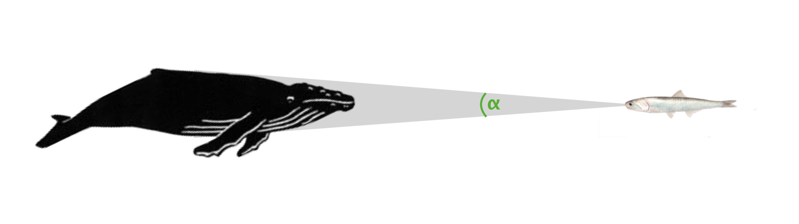
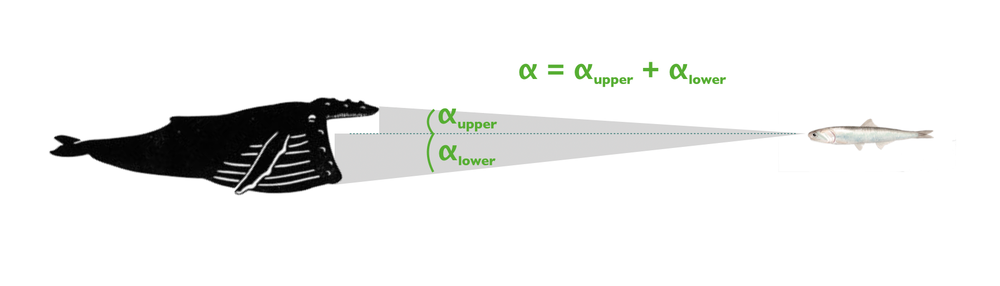

```{r, include = FALSE}
knitr::opts_chunk$set(
  collapse = TRUE,
  comment = "#>"
)
```

```{r setup, echo = FALSE}
library(attackR)
```

This vignette details how `attackR` specifically takes account of the unique lunge feeding mode of rorqual whales (i.e. its gigantic size, and huge expanding buccal cavity) when determining how much of a prey's visual field is occupied by an attacking whale. 

The [**Overview of attackR**](https://nicholascarey.github.io/attackR/articles/main.html) vignette details the basics of the package, so it is highly recommended you read that first. 

# Whale Lunge Feeding

Whale lunge feeding differs from other predator attacks in that when approaching the prey the whale expands its jaws, and these rapidly increase in apparent size until they obscure the rest of the whale's body and dominate the prey's visual field. 

`attack_model_whale` is a whale-specific version of the `attack_model` function with specific inputs and behaviour to deal with this. These include morphometric inputs for jaw location and angle, and timings of the mouth opening. 

## **⍺** in whales

As with other predators, the **⍺** of a whale is determined by its maximum width, except at close viewing distances where more anterior parts of the body may project a larger **⍺**. 

<br>
```{r echo = FALSE, out.height = NULL, out.width = "75%", fig.align = "center"}

```
<br>

However, in lunge feeding whales when they open their mouths their jaws rapidly eclipse the **⍺** of the body, and moreover it is not symmetrical, with upper and lower jaws projecting a different **⍺**. 

<br>
```{r echo = FALSE, out.height = NULL, out.width = "75%", fig.align = "center", fig.cap="Illustrations by [Alex Boersma](https://www.alexboersma.com)"}

```
<br>

## Overview of the function

To summarise the function, for each instance of the model: 

- As in [`attack_model`](https://nicholascarey.github.io/attackR/articles/main.html#overview), it determines the **⍺** for the entire whale body using a shape profile
- It then programatically determines the location of both jaw tips during the mouth opening event, and their distance from the prey
- It separately calculates the **α** for each jaw and combines these to give a total jaw **α**
- This is compared to the **α** of the rest of the body to determine the maximum **α**

## Additional inputs

#### `jaw_length`

The distance of the whale's jaw hinge (i.e. where upper and lower jaws meet) from the rostrum (i.e. snout). Can be an exact value or an allometric formula based on length (source: Kahane‐Rapport & Goldbogen, 2018). For example:

``` {r} 
## set body length - 10.5 m
hw_length <- 1050
  
## Humpback Whale jaw location in cm from rostrum
jaw_length = (10^(1.205*log10(hw_length/100) - 0.880))*100

jaw_length
```

#### `jaw_angle_upper`, `jaw_angle_lower`

These are the angles in radians off the longitudnal axis of the upper and lower jaws at maximum gape. In both humpbacks and blue whales this is 0.524 (30°) for the upper jaw and 0.873 (50°) for the lower.


#### `a_mouth_open`, `b_max_gape_start` ,`c_max_gape_end`, `d_mouth_closed`

These determine when and how rapidly the mouth is opened and closed. Each is an index or location along the model when the event occurs. They can be used to examine the results of opening the mouth at different stages of an attack, for example timing maximum gape to be cooincident with maximum speed, or opening the mouth only when very close to the prey. By leaving them `NULL` you can also examine the implications of the whale *not* opening its mouth. 


# Example analysis

Here we will show an example of how **⍺** and **d⍺/dt** change during an attack by a humpback whale. As with the examples in the [**Overview of attackR**](https://nicholascarey.github.io/attackR/articles/main.html) the function requires a shape profile. These were obtained from side and overhead images of humpback whales. Maximum width location as measured from several whales was found to be at 42% along the body in both planes, which is not part of the profiles at 5% resolution and so entered separately. Note, only the widths of the body anterior of the maximum were measured, and profiles contain approximate placeholder values posterior of the maximum width. No part of the body posterior of the maximum width can ever produce a larger **⍺** (see [note here](https://nicholascarey.github.io/attackR/articles/whales.html#additional-notes)).

In this example we also streamline some of the inputs. Body width in both planes and jaw length are entered via formulae of known allometric relationships with body length (source: Kahane‐Rapport & Goldbogen, 2018). 

For speed, we use data from humpback whales feeding on anchovies in Southern California captured via biologging tags, and included as a data file in the package (`attackR::af_speeds_socal.rd`). This is 1500 records long at 60 Hz, and contains both the approach, feeding event, and aftermath of the foraging bout. We use the `model_length` input to place the prey at position `651` which is approximately 1s after the maximum speed of the whale. That is, this times the whale reaching the prey at that moment. This comes from field observations where humpbacks have been seen to slow down close to a school. 

We use the mouth opening inputs to determine the opening of the mouth, in the first example to not open at all, in the second to have the whale reach maximum gape cooincident with reaching the prey. 

We filter widths to use the midpoint value between vertical and horizontal planes (although both will be far exceeded by that of the mouth). We also enter the experimentally determined `dadt_range` that anchovies react to ([link to study](https://www.pnas.org/content/117/1/472)). 

All of these inputs can be varied to examine other scenarios. 

## 1. Mouth not opening

First, we will look at what happens if the whale does not open its mouth:

```{r fig.width = 7, fig.asp = .6}

## Mouth NOT opening

## Body length of humpback whale
hw_length <- 1050

## Body profiles
hw_prof_v <- c(0.000, # 0% nose
               0.344, 0.558, 0.676, 0.721, 0.777, 0.880, 0.931, 0.980, 0.900, 0.800, ## 5-50%
               0.700, 0.600, 0.500, 0.400, 0.300, 0.250, 0.200, 0.150, 0.100, 0.000) ## 55-100% tail

hw_prof_h <- c(0.000,
               0.329, 0.443, 0.595, 0.708, 0.803, 0.847, 0.904, 0.973, 0.900, 0.800,
               0.700, 0.600, 0.500, 0.400, 0.300, 0.250, 0.200, 0.150, 0.100, 0.000)

## Run model
af_socal_model <- attack_model_whale(
  speed = af_speeds_socal.rd,
  model_length = 651,
  frequency = 60,
  body_length = hw_length,
  body_width_v = ((hw_length*0.75)/pi),
  body_width_h = ((hw_length*0.75)/pi),
  profile_v = hw_prof_v,
  profile_h = hw_prof_h,
  max_width_loc_v = 0.42,
  max_width_loc_h = 0.42,
  width_filter = "mid",
  jaw_length = (10^(1.205*log10(hw_length/100) - 0.880))*100,
  jaw_angle_upper = 0.5235988,
  jaw_angle_lower = 0.8726646,
  a_mouth_open = NULL,
  b_max_gape_start = NULL,
  c_max_gape_end = NULL,
  d_mouth_closed = NULL,
  simple_output = TRUE,
  plot = TRUE,
  plot_from = 9,
  plot_to = 11.5,
  alpha_range = NULL,
  dadt_range = c(0.89, 2.06))

get_dist(af_socal_model, dadt = 0.89)
get_time(af_socal_model, dadt = 0.89)
```

In the plot, the light green region is the **d⍺/dt** anchovies react to. Even at the lowest **d⍺/dt** value of 0.89, we can see the whale gets to as close as 87 cm and 0.25 s from the prey. It is somewhat counter-intuitive, but the whale's sheer bulk and size, its tapered shape, and the **d⍺/dt** this projects at these speeds means that if it does not open its mouth, it can get extremely close to an anchovy school before the first fish start to react. This finding was supported by footage taken from cameras attached to humpback whales which shows anchovy schools maintaining cohesion when the whale approaches without lunging ([Vid. S4](https://purl.stanford.edu/mt574ws5287)).

## 2. Mouth opening

Now we will look at what happens when the whale opens its mouth and times maximum gape as it reaches the prey:

```{r fig.width = 7, fig.asp = .6}
## Run model
af_socal_model <- attack_model_whale(
  speed = af_speeds_socal.rd,
  model_length = 651,
  frequency = 60,
  body_length = hw_length,
  body_width_v = ((hw_length*0.75)/pi),
  body_width_h = ((hw_length*0.75)/pi),
  profile_v = hw_prof_v,
  profile_h = hw_prof_h,
  max_width_loc_v = 0.42,
  max_width_loc_h = 0.42,
  width_filter = "mid",
  jaw_length = (10^(1.205*log10(hw_length/100) - 0.880))*100,
  jaw_angle_upper = 0.5235988,
  jaw_angle_lower = 0.8726646,
  a_mouth_open = 613,
  b_max_gape_start = 651,
  c_max_gape_end = 663,
  d_mouth_closed = 709,
  simple_output = TRUE,
  plot = TRUE,
  plot_from = 9,
  plot_to = 11.5,
  alpha_range = NULL,
  dadt_range = c(0.89, 2.06))


```

This shows just how extreme a whale's mouth opening is in terms of how it alters **⍺** and **d⍺/dt**. The entire experimental **d⍺/dt** range anchovies react to is exceeded virtually the moment the mouth starts to open, and 
is compressed into only a few milliseconds. Only now, when the whale is extremely close and already rapidly opening its jaws, will the fish react, and we found that for many of them in a school it is too late. 

This is how a giant whale can sneak up on a school of anchovies, and the timing of the mouth opening is the critical aspect of a whale attack: only a few milliseconds too early and they all escape, too late and the whale risks overshooting its target. 


## Other whales
The online SI for the [PNAS publication](https://www.pnas.org/content/117/1/472) also contains examples of this package being used to detemine **⍺** for blue whales. Other lunge-feeding whale species can also be examined. All that is required is small alterations to some of the inputs, for example jaw length and angle, and the morphological inputs. 


## Additional notes
- Mouth opening **⍺** calculations are done in the vertical plane only, and occur separately from any **⍺** calculations done using the body profiles; if the total jaw **⍺** is greater than the **⍺** determined from the body widths, it will always be selected as the maximum **⍺** regardless of any filtering between vertical and horizontal planes
- All angle measurements are in ***radians*** and **d⍺/dt** is in ***rad/s***.
- No part of the predator body anterior to the maximum width can ever project a higher **⍺** than the maximum width, so shape profiles are only really important from the nose to the maximum width. Values more posterior than that can be placeholders and they will not affect the results. However it is important they have values to maintain the evenly-spaced resolution of the profiles. 


# References

Cade D.E., Carey N., Domenici P., Potvin J., & Goldbogen J.A., 2020. Predator-informed looming stimulus experiments reveal how large filter feeding whales capture highly maneuverable forage fish. *Proceedings of the National Academy of Sciences*, 117 (1) 472-478. https://doi.org/10.1073/pnas.1911099116

Kahane-Rapport, S.R., & Goldbogen, J.A., 2018. Allometric scaling of morphology and engulfment capacity in rorqual whales. *Journal of Morphology* 279, 1256–1268. https://doi.org/10.1002/jmor.20846

